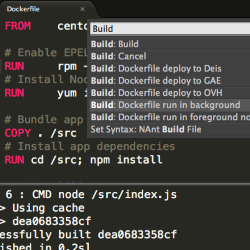
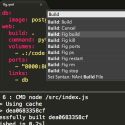
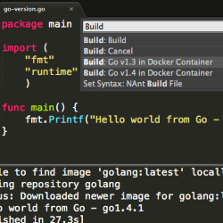
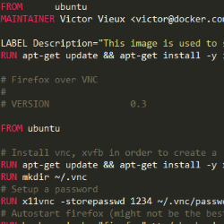

#### [Sublime Docker](https://packagecontrol.io/packages/Docker%20Based%20Build%20Systems)

<ul class="screenshot-images">
  <li>
      
      <h3>docker run</h3>
      
Build images and run containers from Dockerfiles

  </li>
  <li>
      
      <h3>compose up</h3>
      
Run multiple containers using docker-compose

  </li>
  <li>
      
      <h3>ruby, python, java, C++, clojure, golang...</h3>
      
Use Docker language stacks to compile source files

  </li>
</ul>

#### [Dockerfile Syntax Highlighting](https://packagecontrol.io/packages/Dockerfile%20Syntax%20Highlighting)

<ul class="screenshot-images">
  <li>
      
      <h3>Syntax highlighting</h3>
      
Dockerfile syntaxt highlighting for Sublime Text

  </li>
</ul>
