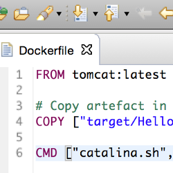
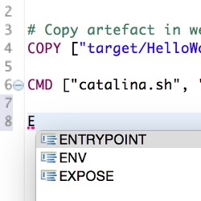
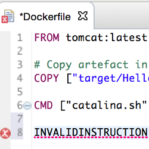
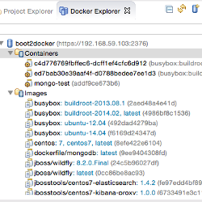
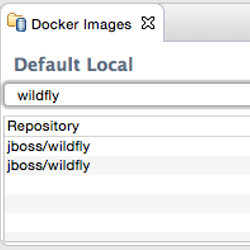
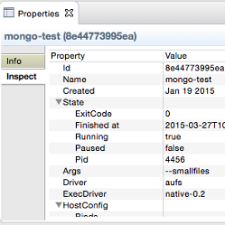

#### [doclipser](https://github.com/domeide/doclipser)

<ul class="screenshot-images">
  <li>
      
      <h3>Syntax highlighting</h3>
      
Dockerfile syntax highlighting

  </li>
  <li>
      
      <h3>Autocomplete</h3>
      
Dockerfile autocomplete

  </li>
  <li>
      
      <h3>Syntax validation</h3>
      
Dockerfile syntax validation

  </li>
  <li>
      
      <h3>Docker commands</h3>
      
Support for some Docker commands: build, run, rm, ps, logs

  </li>
</ul>

#### [Eclipse Linux Tools](http://tools.jboss.org/blog/2015-03-30-Eclipse_Docker_Tooling.html)

<ul class="screenshot-images">
  <li>
      
      <h3>Docker explorer</h3>
      
A tree view that handles multiple docker engines connections and provides users with quick overview of the existing images and containers.

  </li>
  <li>
      
      <h3>Docker images manager</h3>
      
Lists all images in the Docker host and allows user to pull, push, build, start a container

  </li>
  <li>
      
      <h3>Docker explorer</h3>
      
List all containers in the Docker host and allows user to start, stop, pause, unpause, display the logs and kill containers.

  </li>
</ul>

