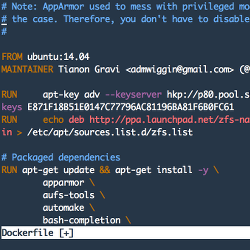

#### [Dockerfile.vim](https://github.com/docker/docker/tree/master/contrib/syntax/vim)

<ul class="screenshot-images">
  <li>
      
      <h3>Syntax highlighting</h3>
      
The syntax highlighting includes, the directives (e.g. FROM), strings and Comments

  </li>
</ul>
