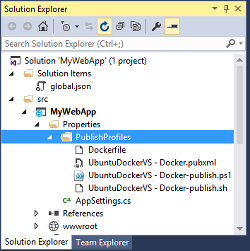

#### [Visual Studio 2015 Tools for Docker](https://aka.ms/DockerToolsForVS)

<ul class="screenshot-images">
  <li>
      
      <h3>Linux runtime environment</h3>
      
Publish web applications in a Docker Container

  </li>
</ul>
