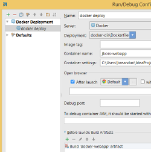
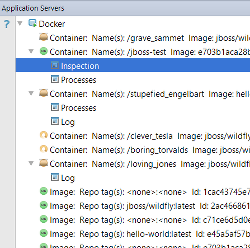

#### [Docker plugin](https://plugins.jetbrains.com/plugin/7724)

<ul class="screenshot-images">
  <li>
      
      <h3>Run/Debug configuration</h3>
      
Allows user to specify the docker engine target, an appropriate Dockerfile, and give containers a name

  </li>
  <li>
      
      <h3>Inspect Containers</h3>
      
Inspect containers and view running processes from the Application Servers tool window. User can search through logs, start and stop containers, and perform basic container management like creating and deleting containers

  </li>
</ul>
