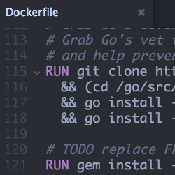

#### [Atom Docker syntax highlighting](https://atom.io/packages/language-docker)

<ul class="screenshot-images">
  <li>
      
      <h3>Syntax highlighting</h3>
      
Atom syntax highlighting for Dockerfiles

  </li>
</ul>

