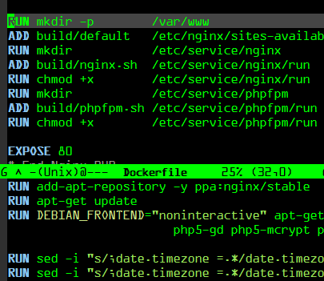

#### [dockerfile-mode](https://github.com/spotify/dockerfile-mode)

<ul class="screenshot-images">
  <li>
      
      <h3>Dockerfile syntax highlighting and image build</h3>
      
Adds syntax highlighting as well as the ability to build the image directly from Emacs.

  </li>
</ul>
